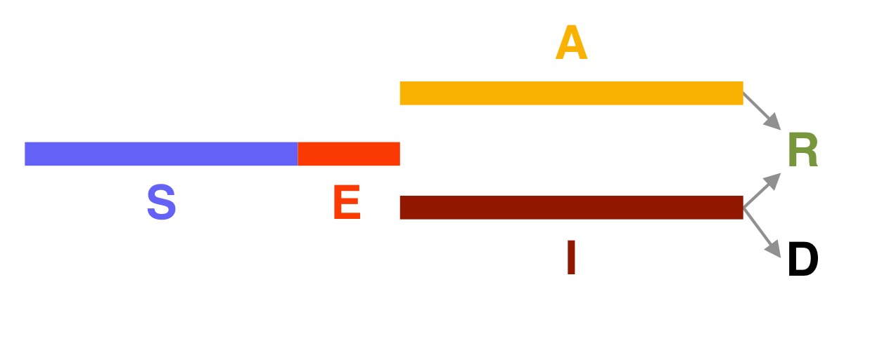

# epidsampler

<!-- badges: start -->
[](https://travis-ci.com/vincnardelli/epidsampler)
[](https://codecov.io/gh/vincnardelli/epidsampler?branch=master)
<!-- badges: end -->

## Overview
**epidsampler** is a package for generating simulated epidemic dataset. Useful for testing sampling methods.


## Installation

``` r
# The easiest way to get epidsampler is to install it from GitHub:
# install.packages("devtools")
devtools::install_github("vincnardelli/epidsampler")
```

## How to use
The simulation is divided in two main function. We generate the regular squared lattice grid and the individuals using genmap(). Then, for each day of the simulation (referred as "step"), we simulate the mobility, social interaction and the evolution of the epidemics with the infection and evolution of the disease for each individual in the map.


### genmap()
#### Map generation
For the map generation we considered a population distributed into spatial units laid on a **n**-by-**n** regular squared lattice grid. Each square of the grid contains a number of individuals randomly drawn from a uniform distribution ranging between the two values contained in the vector **p**. This geographical representation is very general in that the map thus generated can represent, e. g., a city divided into blocks or a region divided into smaller spatial union or any other meaningful geographical partition.

``` r
map <- genmap(n=5, p=c(80, 100))
```

### addstep() - addsteps()
#### Mobility
The contagion mechanism is favoured by people mobility. In this simulation, we assumed that in any moment of time a certain percentage **m** of the population can move between the squares. In this way it is possible to distinguish different epidemic phases such as free-to-move period and lockdown. The commuting during the lockdown period is not only limited by the number of people who move, but also by the extent of their movements. This is a further simulation parameter which is generated by a uniform distribution ranging from **-s** to **s**.


#### Social interaction
Given the mobility pattern described above, contagion is determined by the social interaction and the contact opportunities. The number of contacts in each square of the grid is assumed to be determined by a random number drawn from a Poisson distribution with parameter, say **cn**, while the number of people involved in the movements is also a Poisson number characterised but a different parameter **cp**. Given these assumptions, a contagion occurs in the following way. If in a meeting it is present at least one asymptomatic or an exposed person, **im** susceptibles will be infected moving in the status of the Exposed.


#### Evolution of the epidemics
First of all, in order to simulate an artificial population describing the time evolution of an epidemics, we considered a popular model constituted by a system of six differential equations which, in each moment of time, describe six categories of individuals, namely: the susceptibles (S), those exposed to the virus (E), the infected with symptoms (I), those without symptoms (A) and those that are removed from population either because healed (R) or dead (D). This modelling framework is due to the seminal contribution of Hamer (1906), Kermack and McKendrick (1927) and Soper (1929) and it is often referred to as the “SIR model” from the initials of the categories considered in the first simplified formulation: Susceptibles, Infected and Removed. A comprehensive overview of this model is contained in Cliff et al. (1981). See also Vynnycky and White (2010). The figure below describes diagrammatically the transition between the 6 categories. 


For the data random generation, we assumed that, if infected, a susceptible element of the population (S) will remain in the exposed state (E) for the time **tE**. After that period the subject can become either infected with symptoms (I) with probability **ir** or without (asymptomatic; symbol A) with probability **1-ir**. The asymptomatic will remain infected (and so still able to transmit the virus) for **tA** days. After this period all the asymptomatic will be considered healed and will pass to the category removed (R). In contrast, the infected people showing symptoms will be healed with probability **1-cfr** or die (D) with probability **cfr** (case death rate). 


## Simulation parameters
                                 
#### Classification of individuals:

- **S** subsceptible
- **E** exposed
- **I** infected
- **R** removed
- **D** death                            
- **A** asyntomatic

#### Map generation:

- **n** grid dimension
- **p** people density min/max - uniform distribution

#### Mobility:

- **m** % of moving people
- **s** step size

#### Social interaction:

- **cn** mean of contacts inside a tile
- **cp** mean of number of people for each contact
- **im** mean of number of people infected


#### Evolution of the epidemic:

- **tE** number of days of E condition
- **tI** number of days of I condition
- **tA** number of days of A condition
- **ir** infected rate I/(A+I)
- **cfr** case fatality rate


## Authors and mantainers
Vincenzo Nardelli - vincnardelli@gmail.com

Giuseppe Arbia
